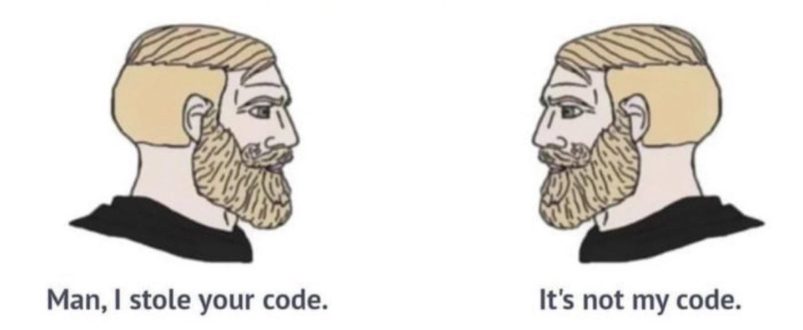

# Assignment Instruction
Please write a python script that will print all prime numbers in a given range. Please leave comments in your script. Only Python and Python modules that could be installed via `conda` or `pip` could be used in this assignment.

This assignment is __10%__ of your total grade.

## Expected result
```
Please input a number: 50
There are 15 prime numbers less than 50.
They are:
2,3,5,7,11,13,17,19,23,29,31,37,41,43,47
```

## Requirements
- The program should ask the user to input a number, list and count all prime numbers less than the input number.
- Assume that the input is a positive integer.
- You should define at least one function in your script.
- Functions should be documented with docstrings.

## Grading Policy
For this assignment, its okay to copy and paste code from the Internet, as long as it works and you understand it. However, you should __NOT__ simply copy and paste code from your classmates. If you do so, you will get a zero for this assignment. Modify the code you found on the Internet or learned from your classmates, so that it looks different from your classmates.

- A: Your algorithm is more efficient than the regular solution.
- B: Your script works and is well documented.
- C: Your script works but is not well documented.
- F: Your script does not work.

**This grading policy only applies to this assignment.**

## Developers IRL
👦🏼 Primary school: “Don’t copy from your neighbor”

🏫 High school: “You can’t hand in the same homework as another student”

🎓 University: “Plagiarism disqualifies your paper”

Now, developers at work:

image credit: Marc Backes

## Submission
Please submit your python scripts (.py) via Moodle NCKU.
If your scripts come with an instruction, please upload it along with the Python script.

For the deadline, please refer to Moodle.

Late submission is accepted yet the score will be lower by 2 tiers.