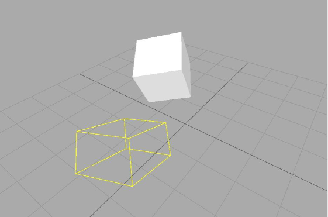

# Exercise Instruction
Project box to xy-plane

* Create a box and transform it to a certain location.
* Create a __Projection__ (can be orthogonal, parallel or perspective) and project the box' vertices onto the xy-plane.
* Draw the edges of the projected box corners with an Artist of your preference. (tip: __Box__ will help you there...)

