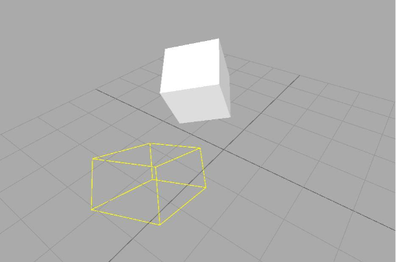

# Exercise — Project a box to the XY plane  (Week 05 companion)

> Open-ended practice alongside the [Week 05](/Lecture/Lecture_03/README.md)
> checkpoints. `uv run your_script.py`.

- Create a box and transform it to some location off the ground.
- Build a **Projection** (orthogonal, parallel, or perspective) and project the
  box's eight corners onto the XY plane.
- Draw the edges of the projected corners in the viewer of your choice.

The checkpoint `flatten_to_xy` in Week 05 is the pure, testable core of this —
do that first, then use it here and add the visualisation on top. That split
(tested core, thin drawing layer) is exactly the Week 06 architecture in
miniature.
