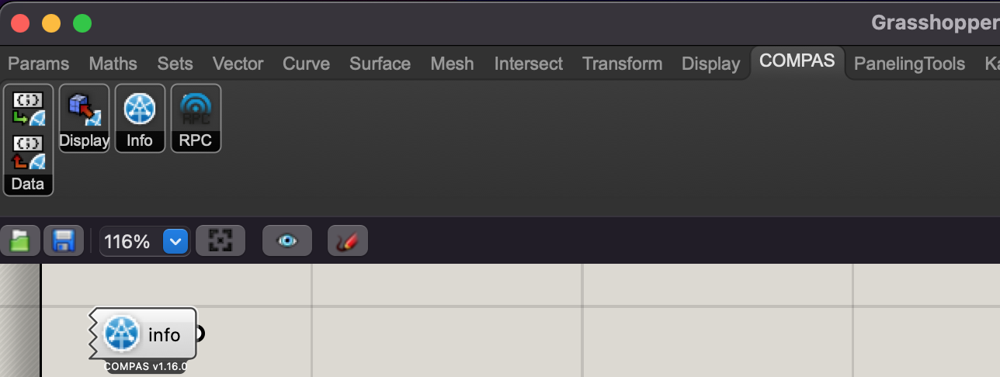

# Lecture 03: COMPAS Core
## Slides
👉[Slides](https://app.rccn.dev/slidev/DCCG-03-1)

## Installing COMPAS
Open `Anaconda Powershell Prompt (miniconda3)` (Windows), or `Powershell` (Windows),  or `Terminal` (macOS).

First, we have to add `conda-forge` as a channel for `conda` to fetch packages. This only needs to be done once on every computer.
```
conda config --add channels conda-forge
```
If the command return nothing, it means the channel has been added successfully.

Next, create a new environment for this course:
```
conda create -n DCCG python=3.11
```


When prompted, type `y` to proceed.


When finished, activate the environment, so that we could install packages into it.
```
conda activate DCCG
```


When an environment is activated, the name of the environment will be shown in front of the command prompt. In this case, it is `(DCCG)`. Continue to install COMPAS and COMPAS_view2:
```
conda install compas compas_view2
```


These step might take a while. You might experience a warning like this. It is because the some module we use is not yet a stable version. When prompted, type `y` to proceed.


## Verify COMPAS installation
When finished, test if the installation is successful. Go back to vscode and open the example `Lecture/Lecture_03/COMPAS_Core_Examples/001_primitives.py`. Check the bottom right corner of the window. If it shows `Python 3.11.0 64-bit ('DCCG': conda)`, it means the script will be executed in the correct environment. If not, click the Python version and select `DCCG: conda`.


Once the correct environment is selected, click the `Run` button on the top right corner of the window. If the installation is successful, you should see a window like this:


## Installing COMPAS for Rhino
Some functions of COMPAS are compatible with Rhino.

First step, make sure the scripting interface of Rhino has been initialized at least once. This only needs to be done once on every computer. To do that, open Rhino and navigate to `Tools > PythonScript > Edit...`. Once the script editor shows up, the interface is successfully initialized, and Rhino could be closed.

Finally, depending on your installed Rhino version, execute one of the flollowing:

### Rhino 6
```
python -m compas_rhino.install -v 6.0 -c
```

### Rhino 7
```
python -m compas_rhino.install -v 7.0 -c
```


## Verify COMPAS-Rhino Installation
Check if the tab COMPAS exists in Grasshopper. Place the `info` component on the canvas to get more information.

    
## Using COMPAS and VScode along with Rhino/GH
Open and __save__ Grasshopper file. 
Copy the following codes into a Grasshopper Python Component.
Adjust the component setting as instructed.

```Python
"""
Get the path of files in the same folder with this GH file.
If filename is omitted, this will return the path of this GH file.

Please configure the Grasshopper component's parameters as the following:
Input:
    - filename: list_access, type_hint: str
Output:
    - path
    - file
"""

import Grasshopper
import os

filepath = ghenv.Component.OnPingDocument().FilePath
path = os.path.dirname(filepath)
if filename:
    path = os.path.join(path, *filename)


file = None
if os.path.isfile(path):
    with open(path) as f:
        file = f.read()
```

## Conda init issue

Windows:
Open Powershell and type `$PROFILE`, manually edit the `.ps1` file with the following code.

```

#region conda initialize
# !! Contents within this block are managed by 'conda init' !!
(& "%UserProfile%\miniconda3\Scripts\conda.exe" "shell.powershell" "hook") | Out-String | Invoke-Expression
#endregion


```