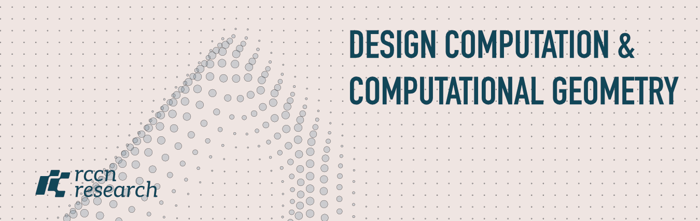

# ARCH3045 Design Computation and Computational Geometry

The intersection of computational design and digital fabrication has changed how
we design, analyze, and construct our built environment. Computational geometry
is at the core of that — from initial form-finding to actual construction — and
this course explores the algorithms, data structures, geometric operations, and
design-to-fabrication workflows that let you create high-performance designs,
intricate geometries, and lightweight parts with minimal material.

The newer shift the course takes seriously: **we embrace agentic development —
building software with AI coding assistants — but we insist on using them
professionally.** A model can write most of the code now; the scarce skill has
moved from *typing* it to *specifying, reading, verifying, and owning* it. So
alongside geometry, you learn the software engineering that keeps AI-written code
honest: tests, review, version control, and reproducible pipelines. Every week
the same question returns: *how do you know this is right?*

**By January you build** a small, tested Python + COMPAS design tool that runs
with or without Rhino — the same core logic usable headlessly, in CI, and inside
Rhino 8 / Grasshopper through a thin adapter.

* E7-125 / E735400 / ARCH3045 · **WED 13:10–15:00** · Computer lab (5102)
* First session **2026.09.09** · Office hour Wed 15:10–17:00 · ccyen @ gs.ncku.edu.tw
* **New here? → [Setup](SETUP.md)** · stuck? → [Troubleshooting](TROUBLESHOOTING.md)

## Schedule, 2026 Fall

🎬[Slide Streaming](https://slide-stream.rccn.dev/) — the slides, live during class.

### Part I — Literacy: read, run, debug (W01–W04)

| Week | Date | Session | Practice |
| ---- | ---------- | ------- | -------- |
| 01 | 2026.09.09 | **Introduction & Toolchain** — how the course works; Python, git/GitHub, Zed, `uv`, and an AI assistant. 👉[Lecture](/Lecture/Lecture_00/README.md) | Setup + first commit (**A0**) |
| 02 | 2026.09.16 | **Python I** — values, types, lists, functions. Reading code, not only writing it. 👉[Lecture](/Lecture/Lecture_01/README.md) | 📝[Exercise](/Exercise/Lecture_01/README.md) |
| 03 | 2026.09.23 | **Python II** — control flow, modules; reading a traceback. 👉[Lecture](/Lecture/Lecture_02/README.md) | 📝[Exercise](/Exercise/Lecture_02/README.md) |
| 04 | 2026.09.30 | **Python III + AI literacy** — dicts, file IO, JSON; what an LLM is, and reviewing generated code. 👉[Lecture](/Lecture/Lecture_04/README.md) | Checkpoint 5: find the AI's bugs |

### Part II — Geometry as pure functions (W05–W09)

| Week | Date | Session | Practice |
| ---- | ---------- | ------- | -------- |
| 05 | 2026.10.07 | **COMPAS core** — Point, Vector, Frame, Box; transformations; geometry as a pure function. 👉[Lecture](/Lecture/Lecture_03/README.md) | 📝[Rotating boxes](/Exercise/Lecture_03/README.md) |
| 06 | 2026.10.14 | **Software Engineering I — the dual-mode architecture** ⭐ — core → artifact → adapter; the `uv` lockfile; git branches and PRs. 👉[Lecture](/Lecture/Lecture_06/README.md) | Refactor a script into core + runner |
| 07 | 2026.10.21 | 🚫 self-paced · **OOP** — classes, attributes, methods; a design element as an object. 👉[Lecture](/Lecture/Lecture_08/README.md) | 📝[OOP exercises](/Exercise/Lecture_08/README.md) |
| 08 | 2026.10.28 | 🚫 self-paced · **Recursion** — base cases, depth, self-similar geometry; AI as a tutor. 👉[Lecture](/Lecture/Lecture_07/README.md) | 📝[Branching tree](/Exercise/Lecture_07/README.md) |
| 09 | 2026.11.04 | **Mesh + debrief** — `Mesh` as a data structure; attributes as dictionaries; peer review of the self-paced weeks. 👉[Lecture](/Lecture/Lecture_05/README.md) | 📝[Mesh exercise](/Exercise/Lecture_05/README.md) |

### Part III — Engineering the workflow with AI (W10–W14)

| Week | Date | Session | Milestone |
| ---- | ---------- | ------- | --------- |
| 10 | 2026.11.11 | **Software Engineering II — Testing** — `pytest`; properties not pictures; the failure path; tests as an executable spec. 👉[Lecture](/Lecture/Lecture_12/README.md#part-a--testing-week-10) | 🎓 **Final project brief released** |
| 11 | 2026.11.18 | **Agentic Workflows I** — the LLM as a stateless function; structured output; tools + loop = agent. Build the harness yourself. 👉[Lecture](/Lecture/Lecture_11/README.md) | — |
| 12 | 2026.11.25 | **Agentic Workflows II** — multi-agent, the coder/reviewer loop, the human gate, why `--auto` is dangerous. 👉[Lecture](/Lecture/Lecture_11/README.md) | 🎓 **Proposal + pitch** 📝 [Agentic lab](/Assignment/6_agentic_workflow/README.md) opens |
| 13 | 2026.12.02 | **Review, git & test-driven agents** — pytest as the un-arguable reviewer; the human review that remains; PR-based review. 👉[Lecture](/Lecture/Lecture_12/README.md#part-b--review-and-the-test-driven-agent-week-13) | 📝 Agentic lab |
| 14 | 2026.12.09 | **Deploy: a Grasshopper plugin set, outside Rhino** ⭐ — components without `rhinoscriptsyntax`; the COMPAS Python→`.ghuser` pipeline on GitHub Actions; the loop as a workflow you *direct*. 👉[Lecture](/Lecture/Lecture_12/README.md#part-c--deploy-shipping-a-grasshopper-plugin-set-week-14) · 📦[Plugin set](/Lecture/Lecture_12/plugin_set/README.md) | 📝 Agentic lab due 🎓 **Project iteration 1** |

### Part IV — Build (W15–W18)

| Week | Date | Session | Milestone |
| ---- | ---------- | ------- | --------- |
| 15 | 2026.12.16 | **AI in Design (models, not agents)** — diffusion/ControlNet and CLIP as *ingredients*; optional optimization. 👉[AI](/Lecture/Lecture_10/README.md) · 👉[Optimization](/Lecture/Lecture_09/README.md) | Project work |
| 16 | 2026.12.23 | **Final Project — help desk** (register-based one-on-ones). | 🎓 **Project iteration 2** |
| 17 | 2026.12.30 | **Final Project — packaging clinic.** Feature freeze: README, install, tests green, artifact committed, adapter verified. | 🎓 **Feature freeze** |
| 18 | 2027.01.06 | 🎓 **Final Presentations** — live demo: the same core, headless *and* in Rhino/Grasshopper. | 🎓 **Repo due 2027.01.10 23:59** |

## Grading

**The final project is your grade — 100%.**

The one thing you must do to get there is complete the **Weeks 01–09
checkpoints**. They aren't scored — `uv run check.py` turns them green and you're
done — but they are a required completion gate: they are how you actually become
able to build the project. So the course really has just two things, checkpoints
and the final.

The project's criteria are in its
[brief](/Assignment/5_Final_Project/README.md#assessment) — the theme throughout
is **process is worth more than the artifact.** Everything else is optional
preparation: the [A0 setup](/Assignment/0_copilot/README.md), the
[agentic-workflow lab](/Assignment/6_agentic_workflow/README.md) (a dry run of
the project loop), the weekly exercises, and the legacy practice sets (superseded
by the checkpoints).

## AI usage

AI assistants are **allowed and encouraged everywhere, including the final
project** — using them well is a goal of the course. Three rules:

1. **Explain every line you submit.** "The AI wrote it" is not an answer.
2. **Disclose** — keep meaningful prompts in comments or a `log.md`.
3. **Verify, don't trust** — tests and an inspected artifact are evidence; "it
   looked right in the viewer" is not.

The one carve-out: in the agentic lab, the brief, log, and reflection must be
written **by you, not an LLM** — that is the part of the workflow that stays
human.
